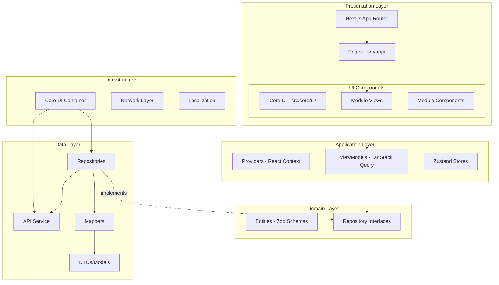
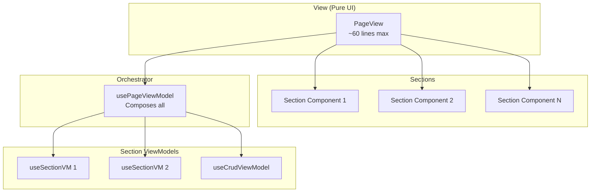
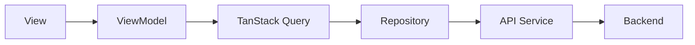
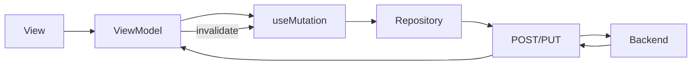

# Verified App - Architecture Documentation

> Comprehensive technical documentation for the Verified ERP Platform architecture.

---

## Table of Contents

1. [Architecture Overview](#architecture-overview)
2. [SOLID View/ViewModel Pattern](#solid-viewviewmodel-pattern)
3. [Module System](#module-system)
4. [CRUD System](#crud-system)
5. [Dependency Injection](#dependency-injection)
6. [Data Flow](#data-flow)
7. [Module Registry](#module-registry)

---

## Architecture Overview



---

## SOLID View/ViewModel Pattern

### Architecture Flow



### SOLID Principles

| Principle                   | Application                                 |
| --------------------------- | ------------------------------------------- |
| **S** Single Responsibility | Each ViewModel handles ONE concern          |
| **O** Open/Closed           | Base hooks extended, not modified           |
| **L** Liskov Substitution   | All ViewModels return consistent interfaces |
| **I** Interface Segregation | Components receive only needed props        |
| **D** Dependency Inversion  | Views depend on ViewModel interfaces        |

### Rules

1. **Views are pure UI** - No state, no logic, no mutations
2. **ViewModels handle all logic** - State, mutations, computed values
3. **One ViewModel per concern** - Statistics, Filters, Table = separate hooks
4. **Orchestrator composes** - Main ViewModel composes section ViewModels
5. **Columns defined in ViewModel** - Not in View or Component

### Example Structure

```
presentation/
├── viewmodels/
│   ├── usePageViewModel.ts       # Orchestrator
│   ├── useStatisticsViewModel.ts # Stats concern
│   └── useFilterViewModel.ts     # Filter concern
├── views/
│   └── PageView.tsx              # Pure UI (~60 lines)
└── components/
    ├── StatisticsSection.tsx     # Section UI
    └── FilterSection.tsx         # Section UI
```

### Code Pattern

```typescript
// View - PURE UI
export function PageView() {
  const vm = usePageViewModel();

  return (
    <div>
      <FilterSection {...vm.filters} />
      <StatisticsSection {...vm.statistics} />
      <GenericCrudView crud={vm.table} columns={vm.columns} />
    </div>
  );
}

// ViewModel - ALL LOGIC
export function usePageViewModel() {
  const statistics = useStatisticsViewModel();
  const filters = useFilterViewModel();
  const table = useCrudViewModel(config);
  const columns = [...]; // Defined here

  return { statistics, filters, table, columns };
}
```

---

## Module System

### Standard Module Structure

```
module/
├── di.ts                     # Module DI Container
├── index.ts                  # Public API
└── src/
    ├── domain/               # Business Logic (Pure TS)
    │   ├── entities/         # Zod Schemas
    │   └── interfaces/       # Repository Contracts
    │
    ├── data/                 # Data Access
    │   ├── models/           # API DTOs
    │   ├── mappers/          # DTO ↔ Entity
    │   └── repositories/     # Implementations
    │
    └── presentation/         # UI (SOLID Pattern)
        ├── viewmodels/       # Section ViewModels
        ├── views/            # Pure UI Pages
        └── components/       # Section Components
```

---

## CRUD System

### Core Components

```
src/core/crud/
├── index.ts                    # All exports
├── types.ts                    # Type definitions
├── hooks/
│   └── useCrudViewModel.ts     # Base CRUD ViewModel
├── views/
│   └── GenericCrudView.tsx     # Orchestrates DataTable
├── components/
│   └── DataTable.tsx           # Flexible table
├── forms/
│   ├── GenericForm.tsx
│   ├── FormDialog.tsx
│   └── ConfirmDialog.tsx
└── utils/
    └── TableColumn.tsx         # Column helpers
```

### Column Helpers

```typescript
column.index("No");
column.text("name", "Name");
column.date("createdAt", "Date", { locale: "en-GB" });
column.status("status", "Status", statusMap);
column.switch("block", "Block", { getChecked, onChange, isLoading });
column.link("email", "Email", { type: "email" });
column.custom("any", "Header", renderFn);
```

---

## Dependency Injection

### Core DI Container

```typescript
// src/core/di.ts
export interface CoreContainer {
  apiService: IApiService;
  authRepository: IAuthRepository;
}
```

### Module DI Pattern

```typescript
// module/di.ts
export const container = {
  someRepository: new SomeRepository(),
};
```

---

## Data Flow

### Query Flow



### Mutation Flow



---

## Module Registry

| Module                  | Type    | Description                  |
| ----------------------- | ------- | ---------------------------- |
| `auth`                  | Core    | Authentication, user session |
| `home`                  | Feature | Home page components         |
| `admin`                 | Parent  | Admin panel                  |
| `admin/dashboard`       | Child   | Dashboard statistics         |
| `admin/user-management` | Child   | User CRUD                    |

---

## Related Documents

- [README.md](../README.md) - Quick start guide
- [.gemini/RULES-memories/](../.gemini/RULES-memories/) - AI architecture rules
