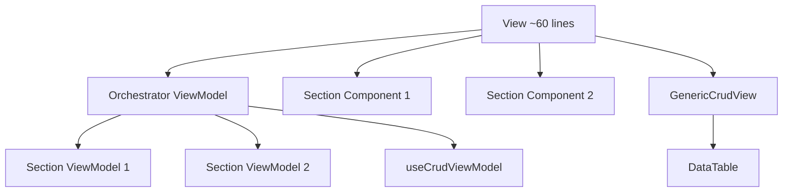

# View/ViewModel Pattern - SOLID Rules

> **MANDATORY** for ALL pages in `src/modules/`. Strict rules for implementing the View/ViewModel pattern following SOLID principles.

---

## The Golden Rule

**Views are PURE UI. ViewModels handle ALL logic.**

> [!CAUTION]
> **ZERO useState/useEffect/useQuery/useMutation in Views.** No exceptions.

---

## Architecture



---

## Rules

### Views

| ✅ DO                      | ❌ DON'T                 |
| -------------------------- | ------------------------ |
| Call ONE ViewModel hook    | Use useState             |
| Pass props to components   | Use useEffect            |
| Render conditionally       | Use useQuery/useMutation |
| Be ~60 lines max           | Use useDebounce          |
| Destructure from ViewModel | Define local handlers    |

```tsx
// ✅ CORRECT - Pure UI (33 lines)
export default function RoleDetailView() {
  const vm = useRoleDetailViewModel();
  return (
    <div className="container mx-auto py-6 space-y-6">
      <RoleDetailHeader {...vm.header} />
      <div className="grid grid-cols-1 lg:grid-cols-4 gap-6">
        <RoleInfoCard {...vm.info} />
        <PermissionTreeCard {...vm.permissions} />
      </div>
    </div>
  );
}

// ❌ WRONG - Logic in View (294 lines - BEFORE refactor)
export default function RoleDetailView() {
  const [selectedPermissionCodes, setSelectedPermissionCodes] = useState(new Set());
  const [expandedCategories, setExpandedCategories] = useState(new Set());
  const { data: role } = useQuery({ queryKey: ["role"] });
  const saveMutation = useMutation({ ... });

  useEffect(() => {
    if (rolePermissions) { ... } // NO!
  }, [rolePermissions]);

  const handleSave = useCallback(() => { ... }); // NO!

  return <Card>...</Card>;
}
```

---

### ViewModels

| ✅ DO                           | ❌ DON'T              |
| ------------------------------- | --------------------- |
| Own ALL state (useState)        | Return JSX            |
| Own ALL queries (useQuery)      | Import components     |
| Own ALL mutations (useMutation) | Use DOM APIs          |
| Own useDebounce, useCallback    | Mix concerns          |
| Return typed props for View     | Expose internal state |

```typescript
// ✅ CORRECT - All logic in ViewModel
export function useRoleDetailViewModel() {
  const [selectedPermissionCodes, setSelectedPermissionCodes] = useState(new Set());
  const { data: role, isLoading } = useQuery({ ... });
  const saveMutation = useMutation({ ... });

  const handleSave = useCallback(() => { ... }, []);

  // Return structured props for View sections
  return {
    header: { role, isLoading, isSaving: saveMutation.isPending, onSave: handleSave },
    info: { role, isLoading, selectedCount, totalCount },
    permissions: { categories, expandedCategories, onToggle: toggleCategory, ... },
  };
}
```

---

### Section Components

| ✅ DO                  | ❌ DON'T                   |
| ---------------------- | -------------------------- |
| Receive props only     | Call ViewModels            |
| Render UI              | Manage state               |
| Be reusable            | Fetch data                 |
| Use destructured props | Use hooks (except useI18n) |

```tsx
// ✅ CORRECT
export function PermissionTreeCard({
  categories,
  isLoading,
  onExpandAll,
  onCollapseAll,
}: PermissionTreeProps) {
  const { t } = useI18n(); // OK: Context for translations
  return <Card>...</Card>;
}
```

---

## File Naming

| Type       | Convention                 | Example                     |
| ---------- | -------------------------- | --------------------------- |
| View       | `{Name}View.tsx`           | `RoleDetailView.tsx`        |
| ViewModel  | `use{Name}ViewModel.ts`    | `useRoleDetailViewModel.ts` |
| Section VM | `use{Section}ViewModel.ts` | `useStatisticsViewModel.ts` |
| Section UI | `{Section}Card.tsx`        | `PermissionTreeCard.tsx`    |

---

## Folder Structure

```
presentation/
├── viewmodels/
│   ├── usePageViewModel.ts        # Orchestrator (owns state)
│   ├── useStatisticsViewModel.ts  # Stats logic
│   └── useFilterViewModel.ts      # Filter logic
├── views/
│   └── PageView.tsx               # Pure UI (~60 lines)
└── components/
    ├── StatisticsCard.tsx         # Stats UI (props only)
    └── FilterBar.tsx              # Filter UI (props only)
```

---

## Anti-Pattern Examples

### ❌ Filter State in View

```tsx
// BAD - useState for filters in View
export function PermissionsView() {
  const [searchInput, setSearchInput] = useState("");
  const [categoryFilter, setCategoryFilter] = useState();
  const debouncedSearch = useDebounce(searchInput, 300);
  const vm = usePermissionsViewModel({ search: debouncedSearch });
}
```

```tsx
// GOOD - Filter state in ViewModel
export function PermissionsView() {
  const { filter, groupedPermissions } = usePermissionsViewModel();
  return <FilterBar {...filter} />;
}
```

---

## Checklist

- [ ] View has NO useState
- [ ] View has NO useEffect
- [ ] View has NO useQuery/useMutation
- [ ] View has NO useDebounce
- [ ] View is under 80 lines
- [ ] ViewModel returns structured props
- [ ] Section components are props-only
- [ ] One concern per ViewModel
