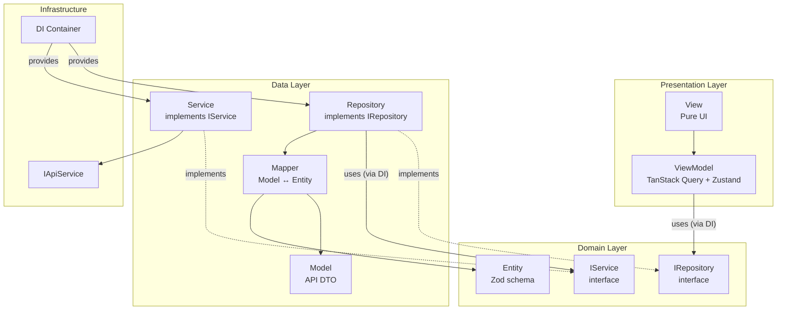
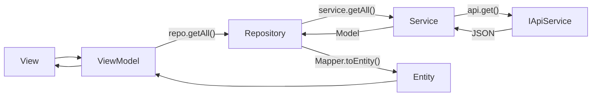
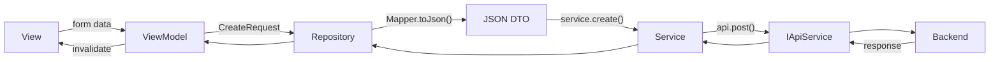

# Verified App - Architecture Documentation

> Comprehensive technical documentation for the Verified ERP Platform architecture.

---

## Table of Contents

1. [Architecture Overview](#architecture-overview)
2. [Layer Boundaries (STRICT)](#layer-boundaries-strict)
3. [Data Flow](#data-flow)
4. [Module System](#module-system)
5. [Dependency Injection](#dependency-injection)
6. [SOLID View/ViewModel Pattern](#solid-viewviewmodel-pattern)
7. [CRUD System](#crud-system)
8. [Module Registry](#module-registry)

---

## Architecture Overview



---

## Layer Boundaries (STRICT)

> [!CAUTION]
> These rules are **ABSOLUTE**. Violating them breaks testability and swappability.

### The Golden Rule

```
View → ViewModel → Repository → Service → IApiService
        ↓            ↓            ↓
     (via DI)    (via Mapper) (via injection)
```

### Layer Rules

| Layer | ✅ CAN Call | ❌ CANNOT Call |
|-------|-------------|----------------|
| **View** | ViewModel hooks | Repository, Service, API |
| **ViewModel** | Repository (via DI) | Service, IApiService |
| **Repository** | Service (injected), Mapper | IApiService directly |
| **Service** | IApiService (injected) | Repository, Mapper |
| **Mapper** | Nothing (pure functions) | Any other layer |

### Why This Matters

| Without Boundaries | With Boundaries |
|-------------------|-----------------|
| Can't swap implementations | Easy test mocks |
| Tight coupling | Loose coupling |
| Hard to test | Easy to test |
| One change breaks many | Isolated changes |

---

## Data Flow

### Read (Query) Flow



### Write (Mutation) Flow



---

## Module System

### Standard Module Structure

```
module/
├── di.ts                     # Module DI Container
├── index.ts                  # Public exports
│
└── src/
    ├── domain/               # Business Logic (Pure TS)
    │   ├── entities/         # Zod Schemas + Entity classes
    │   │   ├── Product.ts
    │   │   └── ProductRequests.ts
    │   └── interfaces/       # Contracts ONLY (no implementations)
    │       ├── IProductRepository.ts
    │       └── IProductService.ts
    │
    ├── data/                 # Data Access
    │   ├── models/           # API DTOs (match backend JSON)
    │   │   └── ProductModel.ts
    │   ├── mappers/          # Model ↔ Entity conversions
    │   │   └── ProductMapper.ts
    │   ├── services/         # Implements IService
    │   │   └── ProductService.ts
    │   └── repositories/     # Implements IRepository
    │       └── ProductRepository.ts
    │
    └── presentation/         # UI (SOLID Pattern)
        ├── viewmodels/       # TanStack Query hooks
        │   └── useProductsViewModel.ts
        ├── views/            # Pure UI (~60 lines max)
        │   └── ProductsView.tsx
        └── components/       # Reusable UI pieces
            └── ProductCard.tsx
```

> [!IMPORTANT]
> Interfaces (`IProductRepository`, `IProductService`) must be in `domain/interfaces/`, NEVER in the same file as implementations.

---

## Dependency Injection

### DI Architecture

```
src/
├── core/
│   └── di.ts                    # Core container (IApiService, etc.)
│
└── modules/
    └── {module}/
        └── di.ts                # Module container (repos, services)
```

### Core DI Container

```typescript
// src/core/di.ts
export interface CoreContainer {
    apiService: IApiService;
    notificationService: NotificationService;
    authRepository: IAuthRepository;
}

let container: CoreContainer | null = null;

export function getCoreContainer(): CoreContainer {
    if (!container) {
        container = initContainer();
    }
    return container;
}
```

### Module DI Container

```typescript
// module/di.ts
import { getCoreContainer } from "@/core/di";
import type { IProductRepository } from "./src/domain/interfaces/IProductRepository";
import type { IProductService } from "./src/domain/interfaces/IProductService";
import { ProductService } from "./src/data/services/ProductService";
import { ProductRepository } from "./src/data/repositories/ProductRepository";

export interface ProductsContainer {
    productService: IProductService;
    productRepository: IProductRepository;
}

let _container: ProductsContainer | null = null;

export function getProductsContainer(): ProductsContainer {
    if (!_container) {
        const { apiService } = getCoreContainer();

        // 1. Create Service (uses IApiService)
        const productService = new ProductService(apiService);

        // 2. Create Repository (uses Service)
        _container = {
            productService,
            productRepository: new ProductRepository(productService),
        };
    }
    return _container;
}

// Public accessor (only exposes Repository, not Service)
export const productsContainer = {
    get productRepository() {
        return getProductsContainer().productRepository;
    },
};
```

### DI Usage in ViewModel

```typescript
// ✅ CORRECT: Get repository from DI
const repo = productsContainer.productRepository;

// ❌ WRONG: Instantiate directly
const repo = new ProductRepository(new ProductService(apiService));
```

---

## SOLID View/ViewModel Pattern

### Principles

| Principle | Application |
|-----------|-------------|
| **S** Single Responsibility | Each ViewModel handles ONE concern |
| **O** Open/Closed | Base hooks extended, not modified |
| **L** Liskov Substitution | All ViewModels return consistent interfaces |
| **I** Interface Segregation | Components receive only needed props |
| **D** Dependency Inversion | Views depend on ViewModel interfaces |

### Rules

1. **Views are pure UI** - No state, no logic, no mutations
2. **ViewModels handle all logic** - State, mutations, computed values
3. **One ViewModel per concern** - Statistics, Filters, Table = separate hooks
4. **Orchestrator composes** - Main ViewModel composes section ViewModels
5. **Columns defined in ViewModel** - Not in View or Component

### Code Pattern

```typescript
// View - PURE UI
export function PageView() {
  const vm = usePageViewModel();
  
  return (
    <div>
      <FilterSection {...vm.filters} />
      <StatisticsSection {...vm.statistics} />
      <GenericCrudView crud={vm.table} columns={vm.columns} />
    </div>
  );
}

// ViewModel - ALL LOGIC
export function usePageViewModel() {
  const repo = moduleContainer.repository; // ← From DI
  
  const query = useQuery({
    queryKey: ['items'],
    queryFn: () => repo.getAll(),
  });
  
  return { data: query.data, isLoading: query.isLoading };
}
```

---

## CRUD System

### Core Components

```
src/core/crud/
├── index.ts                    # All exports
├── types.ts                    # Type definitions
├── hooks/
│   └── useCrudViewModel.ts     # Base CRUD ViewModel
├── views/
│   └── GenericCrudView.tsx     # Orchestrates DataTable
├── components/
│   └── DataTable.tsx           # Flexible table
├── forms/
│   ├── GenericForm.tsx
│   ├── FormDialog.tsx
│   └── ConfirmDialog.tsx
└── utils/
    └── TableColumn.tsx         # Column helpers
```

### Column Helpers

```typescript
column.index('No')
column.text('name', 'Name')
column.date('createdAt', 'Date', { locale: 'en-GB' })
column.status('status', 'Status', statusMap)
column.switch('block', 'Block', { getChecked, onChange, isLoading })
column.link('email', 'Email', { type: 'email' })
column.custom('any', 'Header', renderFn)
```

---

## Module Registry

| Module | Type | Description |
|--------|------|-------------|
| `auth` | Core | Authentication, user session |
| `home` | Feature | Home page components |
| `user` | Feature | User profile management |
| `system` | Parent | System administration |
| `system/admin` | Child | Admin user CRUD |
| `system/roles` | Child | Role management |
| `system/tenants` | Child | Tenant management |
| `system/permissions` | Child | Permission management |
| `system/menus` | Child | Menu configuration |

---

## Related Documents

- [boundaries.md](./boundaries.md) - Module import rules
- [solid-patterns.md](./solid-patterns.md) - Detailed ViewModel patterns
- [state_management.md](./state_management.md) - TanStack Query & Zustand usage
