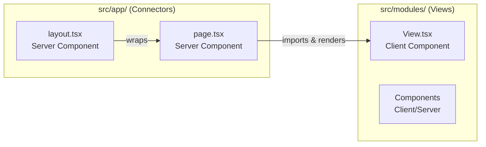

# Component Rules: Server vs Client

> **STRICT RULE**: `src/app/` is for routing only. NO business UI logic.

> **MANDATORY LOCALIZATION**: ALL user-facing text MUST use the `t()` function from `Language()` hook. No hardcoded strings allowed. Components with localization must be Client Components (`'use client'`).

## The Connector Pattern



---

## Decision Tree: Server or Client?

```
┌─────────────────────────────────────────────────────┐
│               Does the component need...?            │
└─────────────────────────────────────────────────────┘
                         │
         ┌───────────────┼───────────────┐
         ▼               ▼               ▼
    ┌─────────┐    ┌──────────┐    ┌─────────────┐
    │ useState │    │ onClick  │    │ useEffect   │
    │ useQuery │    │ onChange │    │ Browser API │
    │ Language │    │ t()      │    │ localStorage│
    └────┬────┘    └────┬─────┘    └──────┬──────┘
         │              │                  │
         └──────────────┴──────────────────┘
                        │
                        ▼
                   ┌─────────┐
              YES  │ CLIENT  │  Add 'use client'
                   └─────────┘

                        │
                        ▼
         ┌─────────────────────────────────────┐
         │  Does it ONLY render static content  │
         │  or pass props to children?          │
         └──────────────────┬──────────────────┘
                            │
                            ▼
                       ┌─────────┐
                  YES  │ SERVER  │  No directive needed
                       └─────────┘
```

> [!NOTE]
> **Localization requires 'use client'**: Components using `Language()` hook or `t()` function must be Client Components because they access React context and localStorage.

---

## Layer Responsibilities

### `src/app/` - The Connectors (Server Components)

| Responsibility    | Example                                          |
| ----------------- | ------------------------------------------------ |
| Define routes     | `(modules)/hr/page.tsx`                          |
| Generate metadata | `export const metadata = {...}`                  |
| Read URL params   | `searchParams`, `params`                         |
| Server-side auth  | Check session, redirect                          |
| Import Views      | `import { EmployeeListView } from '@modules/hr'` |

```typescript
// src/app/(modules)/hr/page.tsx
import { Metadata } from 'next';
import { EmployeeListView } from '@modules/hr/src/presentation/views/EmployeeListView';

export const metadata: Metadata = {
  title: 'Employees | Verified',
  description: 'Manage your organization employees',
};

interface Props {
  searchParams: Promise<{ page?: string; search?: string }>;
}

export default async function HRPage({ searchParams }: Props) {
  const { page, search } = await searchParams;

  return (
    <main>
      <EmployeeListView
        initialPage={Number(page) || 1}
        initialSearch={search}
      />
    </main>
  );
}
```

### `src/modules/.../views/` - The Views (Client Components)

| Responsibility    | Example                    |
| ----------------- | -------------------------- |
| User interactions | Button clicks, form inputs |
| State management  | useState, TanStack Query   |
| Data fetching     | Via ViewModels (hooks)     |
| Rendering UI      | JSX with dynamic content   |

```typescript
// src/modules/hr/src/presentation/views/EmployeeListView.tsx
'use client';

import { useState } from 'react';
import { useEmployees } from '../viewmodels/useEmployees';
import { EmployeeTable } from '../components/EmployeeTable';

interface Props {
  initialPage: number;
  initialSearch?: string;
}

export function EmployeeListView({ initialPage, initialSearch }: Props) {
  const [page, setPage] = useState(initialPage);
  const [search, setSearch] = useState(initialSearch ?? '');

  const { data, isLoading } = useEmployees({ page, search });

  return (
    <div>
      <SearchInput value={search} onChange={setSearch} />
      <EmployeeTable data={data} loading={isLoading} />
      <Pagination page={page} onPageChange={setPage} />
    </div>
  );
}
```

---

## Granular Client Components

When a Server Component needs small interactivity, extract only that part:

### ❌ BAD: Making entire component Client

```typescript
// DON'T: Adding 'use client' to a mostly static page
'use client';

export function SettingsPage() {
  const [darkMode, setDarkMode] = useState(false);

  return (
    <div>
      <h1>Settings</h1>  {/* Static */}
      <p>Description...</p>  {/* Static */}
      <footer>...</footer>  {/* Static */}

      {/* Only this needs client */}
      <Toggle checked={darkMode} onChange={setDarkMode} />
    </div>
  );
}
```

### ✅ GOOD: Extract interactive piece

```typescript
// src/app/settings/page.tsx (Server Component)
import { DarkModeToggle } from './DarkModeToggle';

export default function SettingsPage() {
  return (
    <div>
      <h1>Settings</h1>
      <p>Description...</p>
      <footer>...</footer>

      <DarkModeToggle />
    </div>
  );
}

// src/app/settings/DarkModeToggle.tsx (Client Component)
'use client';
import { useState } from 'react';

export function DarkModeToggle() {
  const [darkMode, setDarkMode] = useState(false);
  return <Toggle checked={darkMode} onChange={setDarkMode} />;
}
```

---

## UI Component Placement

| Location                          | Purpose                          | Example                     |
| --------------------------------- | -------------------------------- | --------------------------- |
| `@core/ui/`                       | Shared, generic components       | Button, Input, Modal, Toast |
| `@modules/{name}/.../components/` | Domain-specific components       | EmployeeCard, VendorBadge   |
| `src/app/{route}/`                | Route-specific tiny client parts | DarkModeToggle (as above)   |

### ❌ NEVER in `src/app/`

- Full feature views
- Data fetching logic
- Business components
- Form handling

---

## Quick Reference

| File Location                     | Component Type | Has `'use client'`? |
| --------------------------------- | -------------- | ------------------- |
| `src/app/**/page.tsx`             | Server         | No                  |
| `src/app/**/layout.tsx`           | Server         | No                  |
| `src/app/**/{Small}Toggle.tsx`    | Client         | Yes                 |
| `src/modules/**/views/*.tsx`      | Client         | Yes                 |
| `src/modules/**/components/*.tsx` | Depends        | Check needs         |
| `src/core/ui/*.tsx`               | Depends        | Check needs         |
