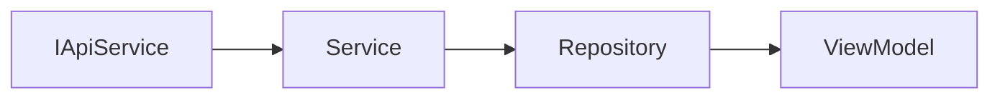

# Dependency Injection Patterns

> **RULE**: All dependencies must be obtained via DI containers. No direct instantiation in ViewModels.

---

## DI Hierarchy

```
src/core/di.ts              → Core services (IApiService, etc.)
    ↓ imported by
src/modules/{module}/di.ts  → Module services & repositories
    ↓ exported to
ViewModels                  → Access via container accessors
```

---

## Core Container

```typescript
// src/core/di.ts
export interface CoreContainer {
    apiService: IApiService;
    notificationService: NotificationService;
    authRepository: IAuthRepository;
}

export function getCoreContainer(): CoreContainer { ... }
```

### What Goes in Core?

| ✅ Include            | ❌ Exclude               |
| --------------------- | ------------------------ |
| `IApiService`         | Module-specific services |
| `NotificationService` | Module repositories      |
| `AuthRepository`      | Feature business logic   |

---

## Module Container Pattern

Every module with services/repositories MUST have a `di.ts`:

```typescript
// modules/{module}/di.ts
import { getCoreContainer } from "@/core/di";

// Import interfaces from domain
import type { IProductRepository } from "./src/domain/interfaces/IProductRepository";
import type { IProductService } from "./src/domain/interfaces/IProductService";

// Import implementations from data
import { ProductService } from "./src/data/services/ProductService";
import { ProductRepository } from "./src/data/repositories/ProductRepository";

export interface ProductsContainer {
  productService: IProductService; // Internal use
  productRepository: IProductRepository; // Public access
}

let _container: ProductsContainer | null = null;

export function getProductsContainer(): ProductsContainer {
  if (!_container) {
    const { apiService } = getCoreContainer();

    // Chain: Service ← API, Repository ← Service
    const productService = new ProductService(apiService);

    _container = {
      productService,
      productRepository: new ProductRepository(productService),
    };
  }
  return _container;
}

// PUBLIC ACCESSOR - Only expose what ViewModels need
export const productsContainer = {
  get productRepository() {
    return getProductsContainer().productRepository;
  },
  // NOTE: productService is NOT exposed to ViewModels
};
```

---

## Wiring Order



**Order of creation:**

1. Get `IApiService` from core DI
2. Create `Service(apiService)`
3. Create `Repository(service)`
4. Export `Repository` to ViewModels

---

## ViewModel Usage

### ✅ CORRECT

```typescript
// In ViewModel
import { productsContainer } from "../../di";

export function useProductsViewModel() {
  const repo = productsContainer.productRepository; // ← From DI

  return useQuery({
    queryKey: ["products"],
    queryFn: () => repo.getAll(),
  });
}
```

### ❌ WRONG

```typescript
// DON'T: Direct instantiation
const service = new ProductService(apiService);
const repo = new ProductRepository(service);

// DON'T: Calling service from ViewModel
const result = await productService.create(data);
```

---

## Interface Location Rules

> [!IMPORTANT]
> Interfaces MUST be in `domain/interfaces/`, NEVER in the same file as implementations.

### ✅ CORRECT Structure

```
domain/
└── interfaces/
    ├── IProductRepository.ts  ← Interface ONLY
    └── IProductService.ts     ← Interface ONLY

data/
├── services/
│   └── ProductService.ts      ← Implementation ONLY
└── repositories/
    └── ProductRepository.ts   ← Implementation ONLY
```

### ❌ WRONG Structure

```typescript
// DON'T: Interface in same file as implementation
// ProductService.ts
export interface IProductService { ... }  // ❌ Move to domain/interfaces/
export class ProductService implements IProductService { ... }
```

---

## Testing with DI

DI allows easy mocking:

```typescript
// Create mock container for tests
const mockRepo: IProductRepository = {
  getAll: vi.fn().mockResolvedValue({ items: [], totalCount: 0 }),
  getById: vi.fn(),
  create: vi.fn(),
  update: vi.fn(),
  delete: vi.fn(),
};

// Inject mock in test
vi.mock("../../di", () => ({
  productsContainer: {
    get productRepository() {
      return mockRepo;
    },
  },
}));
```

---

## Container Checklist

For each module, verify:

- [ ] `di.ts` exists at module root
- [ ] Uses `getCoreContainer()` for `apiService`
- [ ] Creates Services first, then Repositories
- [ ] Only exposes `Repository` (not Service) to ViewModels
- [ ] All types use interfaces (`I*`) not classes
