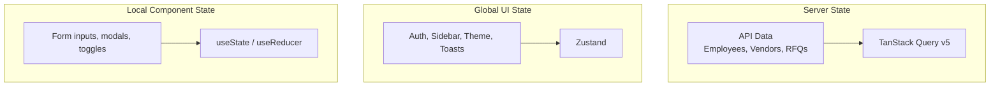

# State Management Rules

> **PRINCIPLE**: Use the right tool for the right state.

## State Categories



---

## TanStack Query (Server State)

**Use for**: Any data that comes from an API and needs caching.

### Responsibilities
- ✅ Data fetching (`useQuery`)
- ✅ Data mutations (`useMutation`)
- ✅ Caching & Background refetching
- ✅ Optimistic updates
- ✅ Pagination & Infinite scroll
- ✅ Request deduplication

### Example: ViewModel Pattern

```typescript
// src/modules/hr/src/presentation/viewmodels/useEmployees.ts
'use client';

import { useQuery, useMutation, useQueryClient } from '@tanstack/react-query';
import { container } from '../../di';

// Keys factory for consistency
export const employeeKeys = {
  all: ['employees'] as const,
  list: (filters: { page: number; search: string }) => 
    [...employeeKeys.all, 'list', filters] as const,
  detail: (id: string) => 
    [...employeeKeys.all, 'detail', id] as const,
};

// Query hook
export function useEmployees(filters: { page: number; search: string }) {
  const repo = container.employeeRepository;
  
  return useQuery({
    queryKey: employeeKeys.list(filters),
    queryFn: async () => {
      const result = await repo.getAll(filters);
      if (result.isErr()) throw result.error;
      return result.value;
    },
    staleTime: 5 * 60 * 1000, // 5 minutes
  });
}

// Mutation hook
export function useCreateEmployee() {
  const queryClient = useQueryClient();
  const repo = container.employeeRepository;
  
  return useMutation({
    mutationFn: async (data: CreateEmployeeInput) => {
      const result = await repo.create(data);
      if (result.isErr()) throw result.error;
      return result.value;
    },
    onSuccess: () => {
      queryClient.invalidateQueries({ queryKey: employeeKeys.all });
    },
  });
}
```

---

## Zustand (Global UI State)

**Use for**: UI state that needs to be shared across components but isn't from the server.

### Approved Zustand Stores

| Store | Purpose | Location |
|-------|---------|----------|
| `useAuthStore` | User session, tokens, permissions | `@core/store/useAuthStore` |
| `useUIStore` | Sidebar state, theme, mobile menu | `@core/store/useUIStore` |
| `useToastStore` | Toast notifications queue | `@core/store/useToastStore` |

### Example: Auth Store

```typescript
// src/core/store/useAuthStore.ts
import { create } from 'zustand';
import { persist } from 'zustand/middleware';

interface User {
  id: string;
  email: string;
  name: string;
  role: 'admin' | 'user';
}

interface AuthState {
  user: User | null;
  token: string | null;
  isAuthenticated: boolean;
  
  // Actions
  login: (user: User, token: string) => void;
  logout: () => void;
  updateUser: (updates: Partial<User>) => void;
}

export const useAuthStore = create<AuthState>()(
  persist(
    (set) => ({
      user: null,
      token: null,
      isAuthenticated: false,
      
      login: (user, token) => set({ 
        user, 
        token, 
        isAuthenticated: true 
      }),
      
      logout: () => set({ 
        user: null, 
        token: null, 
        isAuthenticated: false 
      }),
      
      updateUser: (updates) => set((state) => ({
        user: state.user ? { ...state.user, ...updates } : null,
      })),
    }),
    {
      name: 'auth-storage',
      partialize: (state) => ({ 
        token: state.token,
        user: state.user,
      }),
    }
  )
);
```

### Example: UI Store

```typescript
// src/core/store/useUIStore.ts
import { create } from 'zustand';

interface UIState {
  sidebarOpen: boolean;
  sidebarCollapsed: boolean;
  theme: 'light' | 'dark' | 'system';
  
  toggleSidebar: () => void;
  setSidebarCollapsed: (collapsed: boolean) => void;
  setTheme: (theme: 'light' | 'dark' | 'system') => void;
}

export const useUIStore = create<UIState>((set) => ({
  sidebarOpen: true,
  sidebarCollapsed: false,
  theme: 'system',
  
  toggleSidebar: () => set((s) => ({ sidebarOpen: !s.sidebarOpen })),
  setSidebarCollapsed: (collapsed) => set({ sidebarCollapsed: collapsed }),
  setTheme: (theme) => set({ theme }),
}));
```

---

## Local Component State (useState)

**Use for**: State that belongs to a single component and doesn't need sharing.

### Examples
- Form input values (before submission)
- Modal open/close state
- Accordion expanded state
- Local filtering/sorting UI

```typescript
// Local state example
function SearchableList() {
  const [search, setSearch] = useState('');
  const [isFilterOpen, setIsFilterOpen] = useState(false);
  
  // This state is local - no need for Zustand or Query
  return (
    <div>
      <input value={search} onChange={(e) => setSearch(e.target.value)} />
      <button onClick={() => setIsFilterOpen(!isFilterOpen)}>Filters</button>
    </div>
  );
}
```

---

## Decision Matrix

| Question | If YES, use... |
|----------|---------------|
| Does it come from an API? | TanStack Query |
| Does the whole app need it? | Zustand |
| Is it just for this component? | useState |
| Does it need persistence? | Zustand with persist |
| Does it need caching/refetch? | TanStack Query |

---

## Anti-Patterns

### ❌ DON'T: Put server data in Zustand

```typescript
// BAD: Fetching in useEffect and storing in Zustand
useEffect(() => {
  fetch('/api/employees')
    .then(r => r.json())
    .then(data => useEmployeeStore.setState({ employees: data }));
}, []);
```

### ✅ DO: Use TanStack Query for server data

```typescript
// GOOD: TanStack Query handles everything
const { data: employees } = useQuery({
  queryKey: ['employees'],
  queryFn: () => repo.getAll(),
});
```

### ❌ DON'T: Prop drill global UI state

```typescript
// BAD: Passing sidebar state through 5 components
<App sidebarOpen={sidebarOpen}>
  <Layout sidebarOpen={sidebarOpen}>
    <Main sidebarOpen={sidebarOpen}>
      <Content sidebarOpen={sidebarOpen}>
        <Sidebar isOpen={sidebarOpen} />
```

### ✅ DO: Access Zustand directly where needed

```typescript
// GOOD: Each component reads what it needs
function Sidebar() {
  const { sidebarOpen, toggleSidebar } = useUIStore();
  return <aside className={sidebarOpen ? 'w-64' : 'w-0'}>...
}
```

---

## Summary Table

| State Type | Tool | Location | Persistence |
|------------|------|----------|-------------|
| Server Data | TanStack Query | ViewModels | Cache only |
| Auth/Session | Zustand + persist | `@core/store` | LocalStorage |
| Theme/UI | Zustand | `@core/store` | Optional |
| Toasts | Zustand | `@core/store` | None |
| Form Inputs | useState | Component | None |
| Modal State | useState | Component | None |
| **Localization** | **LanguageProvider** | `@core/providers` | **LocalStorage** |

---

## Localization (LanguageProvider)

**Use for**: Language switching, RTL/LTR support, and translations.

### Architecture

| Component | Purpose | Location |
|-----------|---------|----------|
| `LanguageProvider` | Context provider with language state | `@core/providers/LanguageProvider` |
| `Language()` hook | Access language, direction, and `t()` function | `@core/providers/LanguageProvider` |
| `ar.ts` / `en.ts` | Dictionary files with nested translations | `@core/locales/` |

### Key Features
- ✅ **LocalStorage Persistence**: Language preference saved as `"language"` key
- ✅ **RTL/LTR Support**: Automatically sets `dir` and `lang` on `<html>`
- ✅ **Font Classes**: Adds `font-arabic` or `font-english` to `<body>`
- ✅ **Dot-Notation Access**: `t('common.save')` instead of `t.common.save`
- ✅ **Interpolation**: `t('errors.minLength', { min: 5 })` → `{{min}}`

### Dictionary Structure

```typescript
// src/core/locales/en.ts
export const en = {
  common: {
    loading: 'Loading...',
    save: 'Save',
    cancel: 'Cancel',
    // ...
  },
  auth: {
    login: 'Login',
    logout: 'Logout',
    // ...
  },
  errors: {
    required: 'This field is required',
    minLength: 'Must be at least {{min}} characters',
    // ...
  },
};
```

### Using the `t()` Function

```typescript
'use client';
import { Language } from '@core/providers/LanguageProvider';

export function MyComponent() {
  const { t, language, direction } = Language();
  
  return (
    <div>
      {/* Simple key */}
      <p>{t('common.loading')}</p>
      
      {/* With interpolation */}
      <p>{t('errors.minLength', { min: 5 })}</p>
      
      {/* RTL-aware styling */}
      <div className={direction === 'rtl' ? 'text-right' : 'text-left'}>
        Content
      </div>
    </div>
  );
}
```

### Language Switching

```typescript
'use client';
import { Language } from '@core/providers/LanguageProvider';

export function LanguageSwitcher() {
  const { language, setLanguage } = Language();
  
  return (
    <button onClick={() => setLanguage(language === 'ar' ? 'en' : 'ar')}>
      {language === 'ar' ? 'English' : 'العربية'}
    </button>
  );
}
```

### SSR Fallback

The `Language()` hook provides fallback values during SSR:

```typescript
// Returns this when window is undefined (SSR)
{
  language: 'en',
  direction: 'ltr', 
  setLanguage: () => {},
  t: (key) => key,  // Returns the key itself
}
```

### STRICT RULES

> [!IMPORTANT]
> **NO `[locale]` folders in `src/app/`!** Localization is handled via `LanguageProvider` context, NOT file-based routing.

| ❌ DON'T | ✅ DO |
|----------|-------|
| `src/app/[locale]/page.tsx` | `src/app/page.tsx` + `LanguageProvider` |
| `next-intl` or `next-i18next` | Custom `LanguageProvider` with `t()` |
| URL-based language (`/en/`, `/ar/`) | Cookie/localStorage-based detection |

