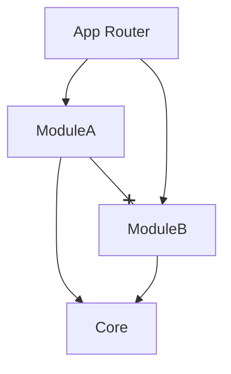

# 🧠 Modularity & Domain Design

The core philosophy of this template is **"Strict Boundaries, Loose Coupling"**.

## The Modular Monolith

Unlike a standard Next.js app where code is scattered by type (components, hooks, pages), we organize code by **Business Domain**.

### The Rule of Dependency

1. **Core** layer has NO dependencies on Modules.
2. **Modules** depend on Core.
3. **Modules** DO NOT depend on other Modules directly.

### Why?
- **Scalability**: You can delete a module folder, and the rest of the app works perfectly.
- **Maintainability**: Everything related to "Auth" is in one folder.
- **Testability**: Interfaces allow easy mocking.

## Directory Structure

### `src/core` (The Infrastructure)
Contains things that **never change** when business rules change.
- UI Components (Buttons, Inputs)
- Network Layer (Axios)
- Generic Logic (CRUD Engine)

### `src/modules` (The Business)
Contains the specific rules of your application.
- `domain/`: Entities (Pure TS classes)
- `data/`: Repositories (API calls)
- `presentation/`: Views & ViewModels (React)
- `di.ts`: Dependency Injection for this module.

## Best Practices

1. **Always use ViewModels**: Never put `useEffect` or complex logic in a View component.
2. **Use the Barrel**: Only export what is needed from `index.ts`. Keep internal logic private.
3. **DI Container**: Always resolve dependencies in `di.ts`, never instantiate services inside components.
