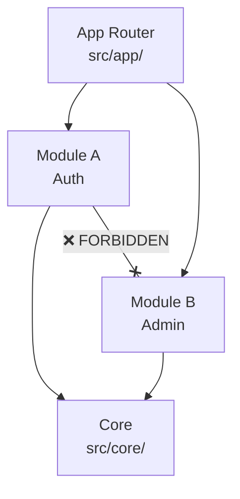

# 🧠 Modularity & Domain Design

> The core philosophy: **"Strict Boundaries, Loose Coupling"** — every module is an isolated island that can be extracted into a standalone microservice.

---

## The Modular Monolith

Unlike a standard Next.js app where code is scattered by type (components, hooks, pages), we organize code by **Business Domain**:

```
Standard Next.js:                    NEXORA Modular:
├── components/                     ├── src/core/          (shared infra)
│   ├── AdminTable.tsx              └── src/modules/
│   ├── AuthForm.tsx                    ├── auth/          (authentication)
│   └── TenantCard.tsx                  ├── admin/         (admin management)
├── hooks/                              ├── tenant/        (tenant management)
│   ├── useAdmins.ts                    └── hr/            (HR module)
│   └── useAuth.ts                          ├── domain/    (entities)
└── pages/                                  ├── data/      (repositories)
    ├── admins.tsx                           └── presentation/
    └── auth.tsx                                ├── viewmodels/
                                                ├── views/
                                                └── components/
```

---

## The Dependency Rule



| Rule  | Allowed                             | Forbidden                        |
| ----- | ----------------------------------- | -------------------------------- |
| **1** | Core has NO dependencies on Modules | Core importing from any module   |
| **2** | Modules depend on Core              | —                                |
| **3** | Modules DO NOT depend on each other | Module A importing from Module B |

### Why?

| Benefit                 | Explanation                                                  |
| ----------------------- | ------------------------------------------------------------ |
| **Scalability**         | Delete a module folder → the rest of the app works perfectly |
| **Team Independence**   | Two teams can work on two modules without merge conflicts    |
| **Testability**         | Each module can be tested in isolation with mocked Core      |
| **Extractability**      | Any module can become a standalone microservice              |
| **Compile-time safety** | TypeScript path mapping enforces boundaries                  |

---

## Directory Structure

### `src/core/` — The Infrastructure

Contains things that **never change** when business rules change:

| Directory         | Purpose                  | Examples                         |
| ----------------- | ------------------------ | -------------------------------- |
| `core/ui/`        | Shared UI components     | Button, Input, Dialog, DataTable |
| `core/network/`   | API client               | Axios service, interceptors      |
| `core/crud/`      | Generic CRUD engine      | useCrudViewModel, GenericForm    |
| `core/store/`     | Global Zustand stores    | useAuthStore, useUIStore         |
| `core/providers/` | React Context providers  | LanguageProvider, ThemeProvider  |
| `core/locales/`   | Translation dictionaries | en.ts, ar.ts                     |
| `core/common/`    | Utilities                | Result pattern, formatters       |

### `src/modules/{name}/` — The Business

Each module is a self-contained clean architecture unit:

```
modules/admin/
├── di.ts                          # Dependency injection container
├── index.ts                       # Public API (barrel exports)
└── src/
    ├── domain/                    # Pure TypeScript — NO imports from React
    │   ├── entities/              # Zod schemas (Admin, CreateAdminInput)
    │   └── interfaces/            # Repository contracts (IAdminRepository)
    ├── data/                      # Implementation layer
    │   ├── models/                # API DTOs (AdminDto, AdminListDto)
    │   ├── mappers/               # DTO ↔ Entity mapping functions
    │   └── repositories/          # API calls (AdminRepository)
    └── presentation/              # React UI (SOLID pattern)
        ├── viewmodels/            # All state & logic (useAdminViewModel)
        ├── views/                 # Pure UI (~60 lines max, zero useState)
        └── components/            # Section components (FiltersSection)
```

---

## Cross-Module Communication

When modules need to interact:

| Pattern            | When                              | Example                                          |
| ------------------ | --------------------------------- | ------------------------------------------------ |
| **URL Navigation** | Link to another module's page     | `<Link href="/admin/123">View Admin</Link>`      |
| **Shared IDs**     | Reference another module's entity | Store `tenantId: string` (not the Tenant object) |
| **Domain Events**  | React to another module's action  | Event bus (future, for microservice mode)        |
| **Core Services**  | Shared functionality              | Both modules use `@core/network/apiService`      |

### ❌ NEVER Do This

```typescript
// Inside auth module — FORBIDDEN
import { AdminRepository } from "@modules/admin/src/data/repositories/AdminRepository";
```

### ✅ Instead

```typescript
// Inside auth module — navigate via URL
import Link from "next/link";
<Link href={`/admin/${adminId}`}>View Admin</Link>
```

---

## Best Practices

1. **Always use ViewModels** — Never put `useEffect` or complex logic in a View component
2. **Use the Barrel** — Only export needed items from `index.ts`, keep internals private
3. **DI Container** — Always resolve dependencies in `di.ts`, never `new Service()` in components
4. **Keep Views under 60 lines** — If it's growing, split into section components
5. **Domain layer is pure** — No React imports, no UI dependencies, just TypeScript + Zod
