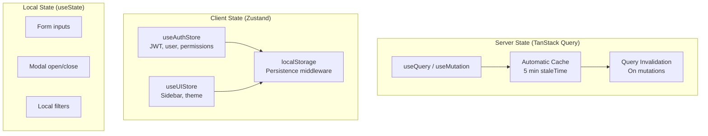

# ⚡ State Management

> Hybrid state approach separating **Server State** (TanStack Query) from **Client State** (Zustand) with SSR-safe hydration.

---

## State Architecture



---

## 1. Server State (TanStack Query v5)

**Use for**: Any data that comes from the backend API.

Reference: `src/core/crud/hooks/`

### Why NOT Redux/Context for API Data?

| Feature            | TanStack Query                    | Redux / Context     |
| ------------------ | --------------------------------- | ------------------- |
| Loading states     | ✅ Automatic (`isLoading`)        | ❌ Manual           |
| Error handling     | ✅ Automatic (`isError`, `error`) | ❌ Manual           |
| Request dedup      | ✅ Same query key = 1 request     | ❌ Multiple fetches |
| Background refetch | ✅ Stale data auto-refreshed      | ❌ Manual           |
| Caching            | ✅ Built-in with TTL              | ❌ Manual           |
| Optimistic updates | ✅ Built-in                       | ❌ Complex          |
| Pagination         | ✅ `keepPreviousData`             | ❌ Complex          |

### Query Pattern

```typescript
// In ViewModel
const { data, isLoading, error } = useQuery({
  queryKey: ["admins", { page, search }], // Cache key
  queryFn: () => container.adminRepo.getAll({ page, search }),
  staleTime: 5 * 60 * 1000, // 5 minutes
});
```

### Mutation Pattern

```typescript
const { mutate, isPending } = useMutation({
  mutationFn: (data) => container.adminRepo.create(data),
  onSuccess: () => {
    queryClient.invalidateQueries({ queryKey: ["admins"] });
    toast.success(t("common.created"));
  },
});
```

### CRUD Shortcut: `useCrudViewModel`

```typescript
const crud = useCrudViewModel({
  queryKey: "admins",
  endpoints: {
    getAll: (params) => adminRepo.getAll(params),
    create: (data) => adminRepo.create(data),
    update: (id, data) => adminRepo.update(id, data),
    delete: (id) => adminRepo.delete(id),
  },
});
// Returns: data, isLoading, create, update, delete, pagination
```

---

## 2. Client State (Zustand)

**Use for**: Global UI state that does NOT come from the API.

Reference: `src/core/store/`

### Approved Stores

| Store              | Purpose                           | Persisted?      |
| ------------------ | --------------------------------- | --------------- |
| `useAuthStore`     | JWT token, user info, permissions | ✅ localStorage |
| `useUIStore`       | Sidebar state, theme preference   | ✅ localStorage |
| `useSettingsStore` | User preferences, display options | ✅ localStorage |

### Store Pattern

```typescript
const useAuthStore = create<AuthState>()(
  persist(
    (set) => ({
      token: null,
      user: null,
      isAuthenticated: false,
      login: (user, token) => set({ user, token, isAuthenticated: true }),
      logout: () => set({ token: null, user: null, isAuthenticated: false }),
    }),
    {
      name: "auth-storage", // localStorage key
      partialize: (state) => ({ token: state.token, user: state.user }),
    }
  )
);
```

### Why Zustand (Not Redux)?

- **Zero boilerplate** — no providers, reducers, action creators
- **Performance** — components re-render only when their specific slice changes
- **TypeScript-first** — full type inference without extra types
- **Tiny** — 1KB bundle size vs 7KB+ for Redux Toolkit

---

## 3. Hydration Guard

Since Zustand persists to `localStorage`, there's a moment during SSR where the state hasn't loaded yet. This causes **hydration mismatches**.

### Solution: `_hasHydrated` Flag

```typescript
// In store
_hasHydrated: false,
setHasHydrated: (state) => { set({ _hasHydrated: state }); }

// In RouteGuard
const hasHydrated = useAuthStore(state => state._hasHydrated);
if (!hasHydrated) return <LoadingSpinner />;
```

This ensures no sensitive content is rendered until the persisted state is available.

---

## Decision Quick Reference

| Question                                  | Use                            |
| ----------------------------------------- | ------------------------------ |
| Data from API?                            | **TanStack Query**             |
| Global UI state shared across components? | **Zustand**                    |
| Only used in this component?              | **useState**                   |
| Needs localStorage persistence?           | **Zustand with persist**       |
| Language/direction?                       | **LanguageProvider** (Context) |
