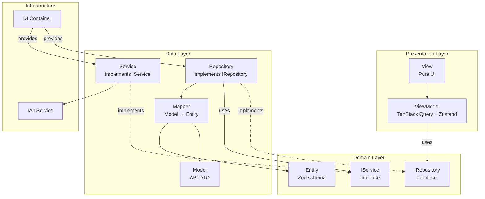

# Complete Module Architecture Specification

> **Canonical Pattern:** `View → ViewModel → Repository → Service → API`

---

## Data Flow Overview



---

## Layer Rules

### 1. View Layer (`.../views/`)

- ✅ Calls ViewModel hooks
- ✅ Renders JSX
- ❌ **NEVER** imports Repository or Service
- ❌ **NEVER** has business logic

### 2. ViewModel Layer (`.../viewmodels/`)

- ✅ Calls Repository (via DI)
- ✅ Uses TanStack Query for caching
- ✅ Returns data for Views
- ❌ **NEVER** calls Service directly
- ❌ **NEVER** calls IApiService directly

### 3. Repository Layer (`.../repositories/`)

- ✅ Calls Service (via DI injection)
- ✅ Uses Mapper to convert Model ↔ Entity
- ✅ Returns **Entities** to ViewModel
- ❌ **NEVER** calls IApiService directly

### 4. Service Layer (`.../services/`)

- ✅ Calls IApiService
- ✅ Returns **Models** (DTOs) to Repository
- ❌ **NEVER** has business logic
- ❌ **NEVER** transforms data (that's Mapper's job)

### 5. Mapper Layer (`.../mappers/`)

- ✅ Converts Model → Entity (for reading)
- ✅ Converts Entity → Model (for writing)
- ❌ **NEVER** has API calls

---

## DI Structure

```
src/
├── core/
│   └── di.ts                    # Core container (IApiService, etc.)
│
└── modules/
    └── {module}/
        └── di.ts                # Module container (repos, services)
```

### How DI Works

```typescript
// 1. Core DI provides IApiService
const { apiService } = getCoreContainer();

// 2. Module DI creates Service (using IApiService)
const productService = new ProductService(apiService);

// 3. Module DI creates Repository (using Service)
const productRepository = new ProductRepository(productService);

// 4. ViewModel gets Repository from DI
const repo = moduleContainer.productRepository;
```

---

## Complete Example Module: `products`

### File Structure

```
src/modules/products/
├── di.ts                              # Module DI container
├── index.ts                           # Public exports
│
└── src/
    ├── domain/                        # Business logic (pure TS)
    │   ├── entities/
    │   │   ├── Product.ts             # Zod schema + Entity class
    │   │   └── ProductRequests.ts     # Create/Update request types
    │   └── interfaces/
    │       ├── IProductRepository.ts  # Repository interface
    │       └── IProductService.ts     # Service interface
    │
    ├── data/                          # Data access
    │   ├── models/
    │   │   └── ProductModel.ts        # API DTO class
    │   ├── mappers/
    │   │   └── ProductMapper.ts       # Model ↔ Entity
    │   ├── services/
    │   │   └── ProductService.ts      # Implements IProductService
    │   └── repositories/
    │       └── ProductRepository.ts   # Implements IProductRepository
    │
    └── presentation/                  # UI
        ├── viewmodels/
        │   ├── useProductsViewModel.ts      # List page orchestrator
        │   └── useProductFormViewModel.ts   # Form logic
        ├── views/
        │   └── ProductsView.tsx       # Pure UI
        └── components/
            └── ProductCard.tsx        # Reusable component
```

---

## Example Files

### 1. Entity (`domain/entities/Product.ts`)

```typescript
import { z } from "zod";

/**
 * Product Entity Schema
 * This is the domain model used throughout the app
 */
export const ProductSchema = z.object({
  id: z.string().uuid(),
  name: z.string().min(1),
  description: z.string().optional(),
  price: z.number().positive(),
  stock: z.number().int().min(0),
  category: z.string(),
  isActive: z.boolean(),
  createdAt: z.date(),
  updatedAt: z.date(),
});

export type ProductData = z.infer<typeof ProductSchema>;

/**
 * Product Entity Class
 */
export class Product {
  readonly id: string;
  readonly name: string;
  readonly description?: string;
  readonly price: number;
  readonly stock: number;
  readonly category: string;
  readonly isActive: boolean;
  readonly createdAt: Date;
  readonly updatedAt: Date;

  constructor(data: ProductData) {
    Object.assign(this, data);
  }

  get isOutOfStock(): boolean {
    return this.stock === 0;
  }

  get formattedPrice(): string {
    return `$${this.price.toFixed(2)}`;
  }
}
```

---

### 2. Request Types (`domain/entities/ProductRequests.ts`)

```typescript
export interface CreateProductRequest {
  name: string;
  description?: string;
  price: number;
  stock: number;
  category: string;
}

export interface UpdateProductRequest {
  name?: string;
  description?: string;
  price?: number;
  stock?: number;
  category?: string;
  isActive?: boolean;
}
```

---

### 3. Repository Interface (`domain/interfaces/IProductRepository.ts`)

```typescript
import type { Product } from "../entities/Product";
import type { CreateProductRequest, UpdateProductRequest } from "../entities/ProductRequests";

export interface ProductListParams {
  page: number;
  pageSize: number;
  search?: string;
  category?: string;
}

export interface PagedResult<T> {
  items: T[];
  totalCount: number;
  page: number;
  pageSize: number;
  totalPages: number;
  hasNextPage: boolean;
  hasPreviousPage: boolean;
}

export interface IProductRepository {
  getAll(params: ProductListParams): Promise<PagedResult<Product>>;
  getById(id: string): Promise<Product>;
  create(request: CreateProductRequest): Promise<string>;
  update(id: string, request: UpdateProductRequest): Promise<void>;
  delete(id: string): Promise<void>;
}
```

---

### 4. Service Interface (`domain/interfaces/IProductService.ts`)

```typescript
import type { ProductModel } from "../../data/models/ProductModel";

export interface ProductListParams {
  page?: number;
  pageSize?: number;
  search?: string;
  category?: string;
}

export interface ProductListResult {
  items: ProductModel[];
  totalCount: number;
  page: number;
  pageSize: number;
  totalPages: number;
  hasNextPage: boolean;
  hasPreviousPage: boolean;
}

export interface CreateProductJson {
  name: string;
  description?: string;
  price: number;
  stock: number;
  category: string;
}

export interface UpdateProductJson {
  name?: string;
  description?: string;
  price?: number;
  stock?: number;
  category?: string;
  isActive?: boolean;
}

export interface IProductService {
  getAll(params: ProductListParams): Promise<ProductListResult>;
  getById(id: string): Promise<ProductModel>;
  create(data: CreateProductJson): Promise<{ id: string }>;
  update(id: string, data: UpdateProductJson): Promise<void>;
  delete(id: string): Promise<void>;
}
```

---

### 5. Model / DTO (`data/models/ProductModel.ts`)

```typescript
/**
 * Product Model (API DTO)
 * Matches exactly what the API returns/expects
 */
export interface ProductJson {
  id: string;
  name: string;
  description: string | null;
  price: number;
  stock: number;
  category: string;
  isActive: boolean;
  createdAt: string; // ISO string from API
  updatedAt: string;
}

export class ProductModel {
  readonly id: string;
  readonly name: string;
  readonly description: string | null;
  readonly price: number;
  readonly stock: number;
  readonly category: string;
  readonly isActive: boolean;
  readonly createdAt: string;
  readonly updatedAt: string;

  constructor(json: ProductJson) {
    Object.assign(this, json);
  }

  static fromJson(json: ProductJson): ProductModel {
    return new ProductModel(json);
  }

  toJson(): ProductJson {
    return {
      id: this.id,
      name: this.name,
      description: this.description,
      price: this.price,
      stock: this.stock,
      category: this.category,
      isActive: this.isActive,
      createdAt: this.createdAt,
      updatedAt: this.updatedAt,
    };
  }
}
```

---

### 6. Mapper (`data/mappers/ProductMapper.ts`)

```typescript
import { Product } from "../../domain/entities/Product";
import type {
  CreateProductRequest,
  UpdateProductRequest,
} from "../../domain/entities/ProductRequests";
import { ProductModel } from "../models/ProductModel";
import type { CreateProductJson, UpdateProductJson } from "../../domain/interfaces/IProductService";

/**
 * ProductMapper
 * Converts between Model (API) ↔ Entity (Domain)
 */
export class ProductMapper {
  /**
   * Model → Entity (for reading from API)
   */
  static toEntity(model: ProductModel): Product {
    return new Product({
      id: model.id,
      name: model.name,
      description: model.description ?? undefined,
      price: model.price,
      stock: model.stock,
      category: model.category,
      isActive: model.isActive,
      createdAt: new Date(model.createdAt),
      updatedAt: new Date(model.updatedAt),
    });
  }

  static toEntityList(models: ProductModel[]): Product[] {
    return models.map(this.toEntity);
  }

  /**
   * Entity → Model (for writing to API)
   */
  static toCreateJson(request: CreateProductRequest): CreateProductJson {
    return {
      name: request.name,
      description: request.description,
      price: request.price,
      stock: request.stock,
      category: request.category,
    };
  }

  static toUpdateJson(request: UpdateProductRequest): UpdateProductJson {
    return {
      name: request.name,
      description: request.description,
      price: request.price,
      stock: request.stock,
      category: request.category,
      isActive: request.isActive,
    };
  }
}
```

---

### 7. Service Implementation (`data/services/ProductService.ts`)

```typescript
import type { IApiService } from "@core/interfaces/api.interface";
import type {
  IProductService,
  ProductListParams,
  ProductListResult,
  CreateProductJson,
  UpdateProductJson,
} from "../../domain/interfaces/IProductService";
import { ProductModel, type ProductJson } from "../models/ProductModel";

interface ProductListResponse {
  items: ProductJson[];
  totalCount: number;
  page: number;
  pageSize: number;
  totalPages: number;
  hasNextPage: boolean;
  hasPreviousPage: boolean;
}

export class ProductService implements IProductService {
  constructor(private readonly api: IApiService) {}

  async getAll(params: ProductListParams): Promise<ProductListResult> {
    const queryParams = new URLSearchParams();
    if (params.page) queryParams.set("page", String(params.page));
    if (params.pageSize) queryParams.set("pageSize", String(params.pageSize));
    if (params.search) queryParams.set("search", params.search);
    if (params.category) queryParams.set("category", params.category);

    const response = await this.api.get<ProductListResponse>(`/products?${queryParams.toString()}`);

    return {
      items: response.items.map(ProductModel.fromJson),
      totalCount: response.totalCount,
      page: response.page,
      pageSize: response.pageSize,
      totalPages: response.totalPages,
      hasNextPage: response.hasNextPage,
      hasPreviousPage: response.hasPreviousPage,
    };
  }

  async getById(id: string): Promise<ProductModel> {
    const json = await this.api.get<ProductJson>(`/products/${id}`);
    return ProductModel.fromJson(json);
  }

  async create(data: CreateProductJson): Promise<{ id: string }> {
    return this.api.post<{ id: string }>("/products", data);
  }

  async update(id: string, data: UpdateProductJson): Promise<void> {
    await this.api.put(`/products/${id}`, data);
  }

  async delete(id: string): Promise<void> {
    await this.api.delete(`/products/${id}`);
  }
}
```

---

### 8. Repository Implementation (`data/repositories/ProductRepository.ts`)

```typescript
import type {
  IProductRepository,
  ProductListParams,
  PagedResult,
} from "../../domain/interfaces/IProductRepository";
import type { IProductService } from "../../domain/interfaces/IProductService";
import { Product } from "../../domain/entities/Product";
import type {
  CreateProductRequest,
  UpdateProductRequest,
} from "../../domain/entities/ProductRequests";
import { ProductMapper } from "../mappers/ProductMapper";

export class ProductRepository implements IProductRepository {
  constructor(private readonly service: IProductService) {}

  async getAll(params: ProductListParams): Promise<PagedResult<Product>> {
    const result = await this.service.getAll(params);

    return {
      items: ProductMapper.toEntityList(result.items),
      totalCount: result.totalCount,
      page: result.page,
      pageSize: result.pageSize,
      totalPages: result.totalPages,
      hasNextPage: result.hasNextPage,
      hasPreviousPage: result.hasPreviousPage,
    };
  }

  async getById(id: string): Promise<Product> {
    const model = await this.service.getById(id);
    return ProductMapper.toEntity(model);
  }

  async create(request: CreateProductRequest): Promise<string> {
    const json = ProductMapper.toCreateJson(request);
    const response = await this.service.create(json);
    return response.id;
  }

  async update(id: string, request: UpdateProductRequest): Promise<void> {
    const json = ProductMapper.toUpdateJson(request);
    await this.service.update(id, json);
  }

  async delete(id: string): Promise<void> {
    await this.service.delete(id);
  }
}
```

---

### 9. Module DI ([di.ts](file:///e:/Templates/Template-Integrated-App/next-frontend-template-modular-clean/src/core/di.ts))

```typescript
import { getCoreContainer } from "@/core/di";
import type { IProductRepository } from "./src/domain/interfaces/IProductRepository";
import type { IProductService } from "./src/domain/interfaces/IProductService";
import { ProductService } from "./src/data/services/ProductService";
import { ProductRepository } from "./src/data/repositories/ProductRepository";

export interface ProductsContainer {
  productService: IProductService;
  productRepository: IProductRepository;
}

let _container: ProductsContainer | null = null;

export function getProductsContainer(): ProductsContainer {
  if (!_container) {
    const { apiService } = getCoreContainer();

    // 1. Create Service (uses IApiService)
    const productService = new ProductService(apiService);

    // 2. Create Repository (uses Service)
    _container = {
      productService,
      productRepository: new ProductRepository(productService),
    };
  }
  return _container;
}

// Convenient accessor
export const productsContainer = {
  get productRepository() {
    return getProductsContainer().productRepository;
  },
  // Note: productService is NOT exposed - only Repository is public
};
```

---

### 10. ViewModel (`presentation/viewmodels/useProductsViewModel.ts`)

```typescript
"use client";

import { useQuery, useMutation, useQueryClient } from "@tanstack/react-query";
import { productsContainer } from "../../di";
import type { CreateProductRequest } from "../../src/domain/entities/ProductRequests";

// Query keys
export const productKeys = {
  all: ["products"] as const,
  list: (params: { page: number; search?: string }) =>
    [...productKeys.all, "list", params] as const,
  detail: (id: string) => [...productKeys.all, "detail", id] as const,
};

export function useProductsViewModel(params: { page: number; search?: string }) {
  const queryClient = useQueryClient();
  const repo = productsContainer.productRepository; // ← From DI, NOT new ProductRepository()

  // Fetch products
  const query = useQuery({
    queryKey: productKeys.list(params),
    queryFn: () => repo.getAll({ ...params, pageSize: 10 }),
  });

  // Create product
  const createMutation = useMutation({
    mutationFn: (request: CreateProductRequest) => repo.create(request),
    onSuccess: () => {
      queryClient.invalidateQueries({ queryKey: productKeys.all });
    },
  });

  // Delete product
  const deleteMutation = useMutation({
    mutationFn: (id: string) => repo.delete(id),
    onSuccess: () => {
      queryClient.invalidateQueries({ queryKey: productKeys.all });
    },
  });

  return {
    // Data
    products: query.data?.items ?? [],
    pagination: query.data
      ? {
          page: query.data.page,
          totalPages: query.data.totalPages,
          totalCount: query.data.totalCount,
        }
      : null,
    isLoading: query.isLoading,
    error: query.error,

    // Actions
    createProduct: createMutation.mutate,
    deleteProduct: deleteMutation.mutate,
    isCreating: createMutation.isPending,
    isDeleting: deleteMutation.isPending,
  };
}
```

---

### 11. View (`presentation/views/ProductsView.tsx`)

```typescript
"use client";

import { useState } from "react";
import { useProductsViewModel } from "../viewmodels/useProductsViewModel";

export function ProductsView() {
    const [page, setPage] = useState(1);
    const [search, setSearch] = useState("");

    const vm = useProductsViewModel({ page, search });

    if (vm.isLoading) return <div>Loading...</div>;
    if (vm.error) return <div>Error: {vm.error.message}</div>;

    return (
        <div>
            <h1>Products</h1>

            <input
                type="text"
                placeholder="Search..."
                value={search}
                onChange={(e) => setSearch(e.target.value)}
            />

            <ul>
                {vm.products.map((product) => (
                    <li key={product.id}>
                        {product.name} - {product.formattedPrice}
                        <button onClick={() => vm.deleteProduct(product.id)}>
                            Delete
                        </button>
                    </li>
                ))}
            </ul>

            {vm.pagination && (
                <div>
                    Page {vm.pagination.page} of {vm.pagination.totalPages}
                    <button onClick={() => setPage(page - 1)} disabled={page === 1}>
                        Prev
                    </button>
                    <button
                        onClick={() => setPage(page + 1)}
                        disabled={page === vm.pagination.totalPages}
                    >
                        Next
                    </button>
                </div>
            )}
        </div>
    );
}
```

---

## Summary: Who Calls Who

| Layer      | Calls       | Via                   |
| ---------- | ----------- | --------------------- |
| View       | ViewModel   | React hooks           |
| ViewModel  | Repository  | DI container          |
| Repository | Service     | Constructor injection |
| Service    | IApiService | Constructor injection |
| Mapper     | Nothing     | Pure functions        |

---

## Key Rules

1. **ViewModel NEVER calls Service** - Always go through Repository
2. **Repository NEVER calls IApiService** - Always go through Service
3. **All dependencies come from DI** - No `new SomeRepository()` in ViewModels
4. **Interfaces live in `domain/interfaces/`** - Separate from implementations
5. **Mapper handles all conversions** - Model ↔ Entity transformations

---

## Type Flow

```
API Response (JSON)
    ↓ Service parses
ProductModel (DTO)
    ↓ Mapper.toEntity()
Product (Entity)
    ↓ Repository returns
ViewModel receives
    ↓ Props passed
View renders
```

```
View submits form
    ↓ ViewModel calls
Repository.create(CreateProductRequest)
    ↓ Mapper.toCreateJson()
CreateProductJson (DTO)
    ↓ Service.create()
API Request
```
