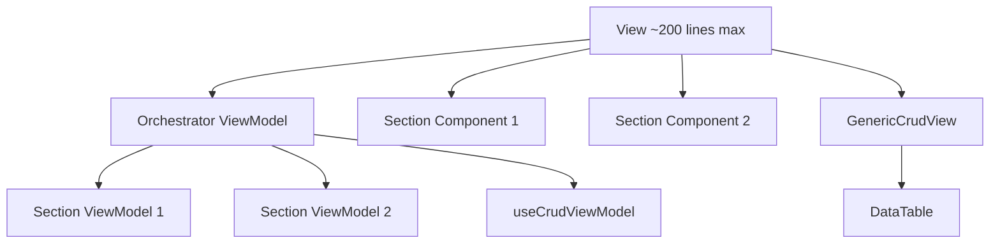

# View/ViewModel Pattern - SOLID Rules

> Strict rules for implementing the View/ViewModel pattern following SOLID principles.

---

## The Golden Rule

**Views are PURE UI. ViewModels handle ALL logic.**

---

## Architecture



---

## Rules

### Views

| ✅ DO                    | ❌ DON'T         |
| ------------------------ | ---------------- |
| Call ONE ViewModel hook  | Use useState     |
| Pass props to components | Use useEffect    |
| Render conditionally     | Call APIs        |
| Be ~200 lines max        | Define mutations |

```tsx
// ✅ CORRECT
export function PageView() {
  const vm = usePageViewModel();
  return (
    <div>
      <FilterSection {...vm.filters} />
      <GenericCrudView {...vm.table} />
    </div>
  );
}

// ❌ WRONG
export function PageView() {
  const [data, setData] = useState([]);
  useEffect(() => { fetch(...) }, []); // NO!
  return <Table data={data} />;
}
```

---

### ViewModels

| ✅ DO                 | ❌ DON'T          |
| --------------------- | ----------------- |
| Handle all state      | Return JSX        |
| Define columns        | Import components |
| Compose other VMs     | Use DOM APIs      |
| Return flat interface | Mix concerns      |

```typescript
// ✅ CORRECT
export function usePageViewModel() {
  const stats = useStatisticsViewModel();
  const filters = useFilterViewModel();
  const table = useCrudViewModel(config);

  const columns = [
    column.index('No'),
    column.text('name', 'Name'),
    column.switch('block', 'Block', {...}),
  ];

  return { stats, filters, table, columns };
}
```

---

### Section Components

| ✅ DO         | ❌ DON'T        |
| ------------- | --------------- |
| Receive props | Call ViewModels |
| Render UI     | Manage state    |
| Be reusable   | Fetch data      |

```tsx
// ✅ CORRECT
interface Props {
  statistics: StatItem[];
  isLoading: boolean;
}

export function StatisticsSection({ statistics, isLoading }: Props) {
  if (isLoading) return <Skeleton />;
  return <Grid>{statistics.map(...)}</Grid>;
}
```

---

## File Naming

| Type       | Convention                 | Example                         |
| ---------- | -------------------------- | ------------------------------- |
| View       | `{Name}View.tsx`           | `UserManagementView.tsx`        |
| ViewModel  | `use{Name}ViewModel.ts`    | `useUserManagementViewModel.ts` |
| Section VM | `use{Section}ViewModel.ts` | `useStatisticsViewModel.ts`     |
| Section UI | `{Section}Section.tsx`     | `StatisticsSection.tsx`         |

---

## Folder Structure

```
presentation/
├── viewmodels/
│   ├── usePageViewModel.ts        # Orchestrator
│   ├── useStatisticsViewModel.ts  # Stats logic
│   └── useFilterViewModel.ts      # Filter logic
├── views/
│   └── PageView.tsx               # Pure UI
└── components/
    ├── StatisticsSection.tsx      # Stats UI
    └── FilterSection.tsx          # Filter UI
```

---

## Checklist

- [ ] View has NO useState/useEffect
- [ ] View is under 200 lines
- [ ] ViewModel returns all props
- [ ] Columns defined in ViewModel
- [ ] Section components are props-only
- [ ] One concern per ViewModel
