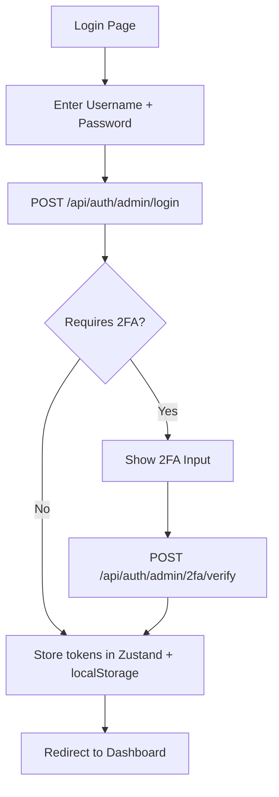

# Auth Module

> Login flow, 2FA verification step, JWT storage, token refresh interceptor, and route guards.

---

## Overview

The auth module handles the entire authentication flow in the frontend — from the login form to 2FA verification, JWT token management, automatic token refresh via API interceptors, and route-level access protection.

---

## Module Structure

```
modules/auth/
├── di.ts                         # DI container (authRepository)
├── index.ts                      # Public exports
└── src/
    ├── domain/
    │   ├── entities/
    │   │   └── Auth.ts           # TokenResponse, LoginRequest schemas
    │   └── interfaces/
    │       └── IAuthRepository.ts
    ├── data/
    │   ├── models/
    │   │   └── AuthModels.ts     # API DTOs
    │   ├── mappers/
    │   │   └── AuthMapper.ts     # DTO ↔ Entity
    │   └── repositories/
    │       └── AuthRepository.ts # API calls
    └── presentation/
        ├── viewmodels/
        │   ├── useSignInViewModel.ts     # Login logic
        │   └── useTwoFactorViewModel.ts  # 2FA verify logic
        ├── views/
        │   ├── SignInView.tsx             # Login page
        │   └── TwoFactorView.tsx         # 2FA input page
        └── components/
            ├── SignInForm.tsx             # Username/password form
            └── OtpInput.tsx              # 6-digit OTP input
```

---

## Authentication Flow



### Login ViewModel

```typescript
export function useSignInViewModel() {
    const router = useRouter();
    const { login } = useAuthStore();
    const repo = container.authRepository;

    const form = useForm<LoginSchema>({
        resolver: zodResolver(loginSchema),
    });

    const loginMutation = useMutation({
        mutationFn: (data: LoginSchema) => 
            repo.login(data.username, data.password, navigator.userAgent),
        onSuccess: (response) => {
            if (response.requires2FA) {
                setStep('2fa');
                setUsername(data.username);
            } else {
                login(response.accessToken, response.refreshToken);
                router.push('/dashboard');
            }
        },
        onError: (error) => {
            form.setError('root', { message: error.message });
        },
    });

    return { form, loginMutation, step, ... };
}
```

---

## Token Management

### Storage (Zustand + persist)

```typescript
// core/store/useAuthStore.ts
interface AuthState {
    accessToken: string | null;
    refreshToken: string | null;
    isAuthenticated: boolean;
    
    login: (accessToken: string, refreshToken: string) => void;
    logout: () => void;
    updateTokens: (tokens: TokenResponse) => void;
}
```

Tokens persisted to `localStorage` via Zustand's `persist` middleware.

### Auto-Refresh Interceptor

```typescript
// core/network/apiService.ts
api.interceptors.request.use((config) => {
    const token = useAuthStore.getState().accessToken;
    if (token) {
        config.headers.Authorization = `Bearer ${token}`;
    }
    return config;
});

api.interceptors.response.use(
    (response) => response,
    async (error) => {
        if (error.response?.status === 401 && !error.config._retry) {
            error.config._retry = true;
            try {
                const newTokens = await refreshTokens();
                useAuthStore.getState().updateTokens(newTokens);
                error.config.headers.Authorization = `Bearer ${newTokens.accessToken}`;
                return api(error.config);
            } catch {
                useAuthStore.getState().logout();
                window.location.href = '/auth/signin';
            }
        }
        throw error;
    }
);
```

---

## Route Guards

### Middleware Protection

```typescript
// middleware.ts (Next.js)
export function middleware(request: NextRequest) {
    const token = request.cookies.get('auth-token');
    
    if (!token && !request.nextUrl.pathname.startsWith('/auth')) {
        return NextResponse.redirect(new URL('/auth/signin', request.url));
    }
}
```

### Hydration Guard

Prevents "flash of unauthenticated content" during SSR hydration:

```typescript
// core/providers/AuthGuard.tsx
export function AuthGuard({ children }) {
    const { isAuthenticated, isHydrated } = useAuthStore();
    
    if (!isHydrated) return <LoadingScreen />;
    if (!isAuthenticated) {
        redirect('/auth/signin');
        return null;
    }
    
    return children;
}
```

---

## 2FA Verification UI

The 2FA step shows:
- 6-digit OTP input (forced LTR direction for RTL languages)
- Auto-submit on 6 digits entered
- Premium styling with shake animation on error
- "Use backup code" toggle option

---

## Related Backend Docs

- [Authentication](../../ASP.Net-Login-Project-CQRS/docs/features/authentication.md) — Complete backend auth architecture
- [Two-Factor Auth](../../ASP.Net-Login-Project-CQRS/docs/features/two-factor-auth.md) — Backend 2FA implementation
