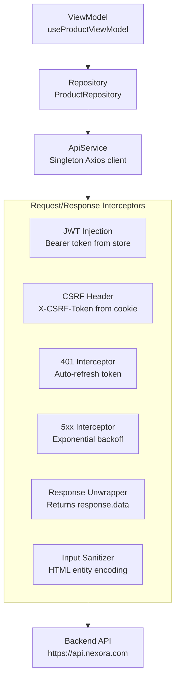

# 🔌 Connecting to API

> How to integrate your module with the backend using the interceptor-enhanced Axios client, repositories, and ViewModels.

---

## Network Layer Architecture



**Location**: `src/core/services/implementation/api.service.ts`

### Built-in Features

| Feature | What It Does | Automatic? |
|---------|-------------|-----------|
| **Base URL** | Uses `NEXT_PUBLIC_API_URL` from `.env` | ✅ |
| **JWT Injection** | Adds `Authorization: Bearer <token>` from auth store | ✅ |
| **CSRF Token** | Adds `X-CSRF-Token` header from cookie | ✅ |
| **Token Refresh** | Intercepts 401, refreshes token, retries original request | ✅ |
| **5xx Retry** | Retries server errors with exponential backoff (1s, 2s, 4s) | ✅ |
| **Response Unwrap** | Returns `response.data` directly | ✅ |
| **Input Sanitization** | Strips `<script>` tags and dangerous HTML | ✅ |

---

## Step 1: Define Entity (Domain Layer)

```typescript
// src/modules/product/src/domain/entities/Product.ts
import { z } from "zod";

export const ProductSchema = z.object({
  id: z.string().uuid(),
  name: z.string().min(1),
  price: z.number().positive(),
  category: z.string(),
  isActive: z.boolean(),
  createdAt: z.string().datetime(),
});

export type Product = z.infer<typeof ProductSchema>;

export const CreateProductSchema = ProductSchema.omit({ id: true, createdAt: true });
export type CreateProductInput = z.infer<typeof CreateProductSchema>;
```

---

## Step 2: Define Repository Interface (Domain Layer)

```typescript
// src/modules/product/src/domain/interfaces/IProductRepository.ts
import { Product, CreateProductInput } from "../entities/Product";

export interface IProductRepository {
  getAll(params: { page: number; search: string }): Promise<PagedResult<Product>>;
  getById(id: string): Promise<Product>;
  create(data: CreateProductInput): Promise<Product>;
  update(id: string, data: Partial<CreateProductInput>): Promise<Product>;
  delete(id: string): Promise<void>;
}
```

---

## Step 3: Implement Repository (Data Layer)

```typescript
// src/modules/product/src/data/repositories/ProductRepository.ts
import { BaseRepository } from "@core/common/base-repository";
import { IProductRepository } from "../../domain/interfaces/IProductRepository";
import { Product, CreateProductInput } from "../../domain/entities/Product";

export class ProductRepository extends BaseRepository implements IProductRepository {
  async getAll(params: { page: number; search: string }) {
    return this.api.get<PagedResult<Product>>("/products", { params });
  }

  async getById(id: string) {
    return this.api.get<Product>(`/products/${id}`);
  }

  async create(data: CreateProductInput) {
    return this.api.post<Product>("/products", data);
  }

  async update(id: string, data: Partial<CreateProductInput>) {
    return this.api.put<Product>(`/products/${id}`, data);
  }

  async delete(id: string) {
    return this.api.delete(`/products/${id}`);
  }
}
```

---

## Step 4: Register in DI Container

```typescript
// src/modules/product/di.ts
import { ProductRepository } from "./src/data/repositories/ProductRepository";

export const productContainer = {
  productRepository: new ProductRepository(),
};
```

---

## Step 5: Use in ViewModel

```typescript
// src/modules/product/src/presentation/viewmodels/useProductViewModel.ts
import { useCrudViewModel } from "@core/crud";
import { productContainer } from "../../../di";

export function useProductViewModel() {
  const repo = productContainer.productRepository;

  const crud = useCrudViewModel({
    queryKey: "products",
    endpoints: {
      getAll: (params) => repo.getAll(params),
      create: (data) => repo.create(data),
      update: (id, data) => repo.update(id, data),
      delete: (id) => repo.delete(id),
    },
  });

  return { ...crud };
}
```

---

## Step 6: Use in View

```typescript
// src/modules/product/src/presentation/views/ProductListView.tsx
"use client";

import { useProductViewModel } from "../viewmodels/useProductViewModel";
import { GenericCrudView } from "@core/crud";

export function ProductListView() {
  const vm = useProductViewModel();

  return <GenericCrudView {...vm} columns={vm.columns} />;
}
```

---

## Error Handling

The `ApiService` automatically normalizes errors:

| Backend Response | Frontend Behavior |
|-----------------|-------------------|
| `400 { error: { message: "Invalid Name" } }` | Toast: "Invalid Name" |
| `401 Unauthorized` | Auto-refresh → retry. If refresh fails → redirect to login |
| `403 Forbidden` | Toast: "Permission denied" |
| `409 Conflict` | Toast: error message from backend |
| `500 Internal Server Error` | Retry 3 times → then show "Server error" toast |

You **don't need** `try/catch` blocks for basic CRUD — `useCrudViewModel` handles all error feedback automatically via toast notifications.

---

## Resilience (Retry with Backoff)

For critical operations that must succeed:

```typescript
// Use getWithRetry for important data
const data = await this.api.getWithRetry<Product[]>("/products/critical");
// Retries 3 times: 1s → 2s → 4s delay
```
