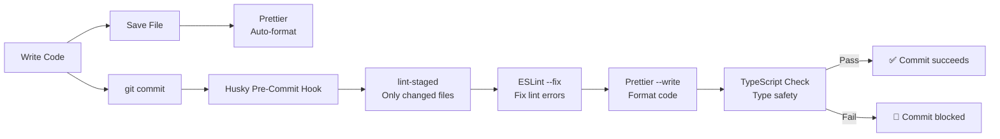

# ✨ Code Quality: Prettier, ESLint & Husky

> Automated code quality enforcement — formatting, linting, and type-checking run on every commit.

---

## Quality Pipeline



---

## 1. Prettier (Formatting)

Prettier eliminates all formatting debates — semicolons, quotes, indentation are all handled automatically.

### Configuration (`.prettierrc`)

```json
{
  "semi": false,
  "singleQuote": false,
  "tabWidth": 2,
  "trailingComma": "all",
  "printWidth": 100,
  "plugins": ["prettier-plugin-tailwindcss"]
}
```

| Setting | Value | Why |
|---------|-------|-----|
| `semi: false` | No semicolons | Cleaner code, TypeScript handles ASI |
| `singleQuote: false` | Double quotes | JSON standard consistency |
| `tabWidth: 2` | 2 spaces | Industry standard for frontend |
| `trailingComma: "all"` | Trailing commas | Cleaner git diffs |
| `tailwindcss plugin` | Auto-sort classes | Consistent Tailwind class ordering |

### Manual Commands

```bash
# Format all files
pnpm format

# Check formatting (CI)
pnpm format:check
```

### Ignored Files (`.prettierignore`)

```
node_modules
.next
dist
pnpm-lock.yaml
```

---

## 2. ESLint (Linting)

ESLint catches code quality issues, unused variables, and potential bugs.

### Configuration (`eslint.config.mjs`)

```javascript
// Key rules
{
  rules: {
    "no-unused-vars": "warn",           // Catch dead code
    "@typescript-eslint/no-explicit-any": "warn",  // Discourage `any`
    "react-hooks/rules-of-hooks": "error",         // Hook rules enforcement
    "react-hooks/exhaustive-deps": "warn",         // Missing hook deps
    "no-restricted-imports": ["error", {           // Module boundaries
      patterns: [{ group: ["@modules/*/*/src/*"] }]
    }]
  }
}
```

### Manual Commands

```bash
# Run lint
pnpm lint

# Auto-fix lint errors
pnpm lint:fix
```

---

## 3. Husky (Git Hooks)

Husky runs quality checks **before** every commit — broken code never reaches Git.

### Pre-Commit Hook (`.husky/pre-commit`)

```bash
#!/usr/bin/env sh
npx lint-staged
```

### lint-staged Configuration (`package.json`)

```json
{
  "lint-staged": {
    "*.{ts,tsx}": [
      "eslint --fix",
      "prettier --write"
    ],
    "*.{json,md,css}": [
      "prettier --write"
    ]
  }
}
```

### What Happens on Each Commit

| Step | Tool | Action |
|------|------|--------|
| 1 | lint-staged | Identifies only **changed** files |
| 2 | ESLint `--fix` | Auto-fixes lint issues where possible |
| 3 | Prettier `--write` | Formats code to standard |
| 4 | TypeScript | Type-checks affected files |
| 5 | ✅ or 🚫 | Commit succeeds or is blocked |

---

## 4. Troubleshooting

### "Commit Failed" — Common Fixes

| Error | Cause | Fix |
|-------|-------|-----|
| `Unexpected any` | Using `any` type | Replace with proper type or `unknown` |
| `unused variable` | Declared but not used | Remove it or prefix with `_` |
| `Hook called conditionally` | Calling hook inside `if` | Move hook before conditionals |
| `Missing dependency` | useEffect missing dep | Add to dependency array |
| `Import restricted` | Cross-module import | Move shared code to `@core/` |

### Emergency Bypass (Not Recommended)

```bash
git commit --no-verify -m "emergency fix"
```

> ⚠️ Only use in genuine emergencies. Bypassed commits should be cleaned up immediately.

### Setup After Clone

```bash
# If hooks aren't running after clone:
pnpm install        # Husky installs automatically via postinstall
npx husky install   # Manual fallback
```
